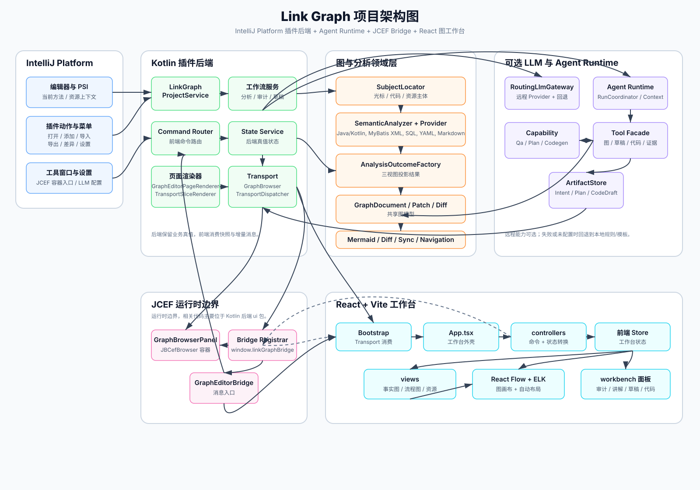

# Link Graph 架构说明

## 概览

Link Graph 是一个 IntelliJ Platform 插件，不是独立桌面程序。后端运行在 IDE 进程内，基于 PSI 和相关 IntelliJ API 提取项目事实，再把图相关工作流暴露给嵌入在 JCEF 工具窗口中的前端界面。

如果只看最核心的主链路，可以把系统理解成：

`编辑器/工具窗口入口 -> 项目服务 -> 分析结果与图状态 -> JCEF bridge -> React 工作台`

## 总体分层

- 入口层
  - `plugin.xml`、动作类、工具窗口工厂和设置入口负责把插件接到 IDE 中。
- 编排层
  - 项目级服务和工作流类负责串联主体定位、分析执行、状态更新和异步请求。
- 分析层
  - `semantic`、`mermaid`、`diff`、`sync` 等模块负责把不同输入转换成统一的图语义或差异语义。
- 状态层
  - 编辑器状态服务与传输渲染器负责维护后端真值，并把它转换成前端可消费的数据。
- 前端层
  - React 工作台根据 bootstrap 和增量消息渲染视图、面板和操作反馈。
- 外部能力层
  - 远程 LLM 提供方、源码导航目标、文件写回目标都属于这一层的外部依赖。

## 主要组成

- 插件入口层
  - 插件描述、动作入口、工具窗口注册和设置页注册都在这一层接入。
- 项目服务与工作流层
  - 项目级服务负责组织链路加载、问答、讲解、实现建议、代码 diff、同步预览和导航等流程。
- 分析与图领域层
  - `semantic` 等模块负责把代码主体和资源主体转换成图导向的分析结果。
- 状态与传输层
  - 后端项目状态保存在服务层中，再被渲染成前端 bootstrap 载荷和增量传输载荷。
- 前端工作台层
  - React 应用负责渲染事实图、流程图、资源关系视图，以及工具栏、面板、弹窗和请求反馈。
- 可选的 LLM 集成层
  - 部分流程可以接入配置好的远程提供方，但当前实现仍然保留本地规则回退路径。

## 后端核心职责

### 动作与工具窗口

- 编辑器动作负责把“当前主体”交给项目服务或工具窗口会话
- 工具窗口层负责创建与持有 JCEF 容器
- 设置入口负责暴露 LLM 预设选择、远程配置和相关行为选项

### 项目服务与工作流

- 统一管理 `semanticFactGraph`（语义事实图）、`workspaceBaseGraph`（工作区基线图）、`workspaceGraph`（当前工作区图）等规范状态，并按场景（scene）隔离选中、布局和差异状态
- 触发分析、问答、讲解、实现建议、草稿、同步预览等流程
- 把前端消息转换成后端命令，再把执行结果写回状态中心

### 分析与图模型

- `semantic` 负责统一语义主体、关系建模以及事实分析主链路
- `model` 负责定义共享图节点、边、差异和补丁结构
- `mermaid`、`diff`、`sync` 等模块基于统一模型提供专项能力

## 前端核心职责

### 工作台结构

- `App.tsx` 负责组装整体页面状态和主要模块
- `controllers/` 负责桥接命令、工作台动作和 bootstrap 消费规则
- `views/` 负责三种主视图各自的渲染和布局输入
- `reactflow/` 负责图画布基础设施和布局接线
- `components/` 负责结果面板、详情面板、弹窗和工具栏

### 三种视图的关系

- 事实图
  - 更强调当前主体上下游关系和事实链路阅读
- 流程图
  - 更强调方法内部的控制流和步骤关系
- 资源关系视图
  - 更强调代码与 XML、SQL、配置、文档等资源之间的连接

这三种视图不是三套完全独立的后端系统，而是对同一批分析结果的不同投影和展示。

## 运行时流程

1. 用户打开工具窗口，或在编辑器中触发相关动作。
2. 后端服务定位当前主体，并生成图导向的分析结果。
3. 后端把当前状态渲染为 bootstrap 载荷或增量传输脚本。
4. 内嵌前端接收状态更新，并渲染当前选中的视图。
5. Mermaid 导入、审计请求、源码跳转等前端动作再通过桥接层回到后端执行。

## 前后端通信方式

- 后端不是直接把一整个页面硬编码到前端，而是通过桥接层下发状态
- 前端初始化时接收 bootstrap 数据
- 后端状态变化后再通过增量传输同步到前端
- 前端的用户操作通过 bridge 命令回传后端

这种方式的核心目标是：后端保留业务真值，前端负责消费和呈现，不让两边长期维护两套彼此漂移的业务状态。

## 状态流转

当前实现里，状态流转可以概括为：

1. 定位当前主体
2. 生成分析结果或工作图变更
3. 写入后端状态服务
4. 渲染 bootstrap 或增量片段
5. 前端更新本地工作台状态
6. 用户继续交互，再发起下一轮后端命令

围绕问答、讲解、实现建议和草稿等异步能力，还会额外维护请求状态、执行模式、失败信息和回退提示。

## LLM 路径与回退路径

LLM 相关能力当前不是单一路径：

- 本地规则路径
  - 不依赖远程提供方，适合作为默认安全回退
- 远程 LLM 路径
  - 依赖用户配置的提供方、接口地址、模型和密钥
- 远程失败回退路径
  - 当远程未启用、配置不完整或请求失败时，结果会回退到本地规则或模板

因此，仓库文档必须把“支持远程能力”和“当前一定走远程”区分开写。

## 前端打包链路

前端源码位于 `web/`。Gradle 会安装依赖、运行前端测试、构建 Vite 应用，并把构建产物复制到生成的插件资源目录中。运行时插件优先从打包后的 `linkgraph/index.html` 读取资源；当打包资源不可用时，开发或测试环境可以回退到 `web/dist`。

## 构建链路

从工程角度看，构建链路主要是：

1. Gradle 负责插件工程构建
2. `web/` 负责前端依赖、测试和打包
3. Gradle 把前端产物复制进插件资源
4. 插件在运行时从资源目录加载前端入口

这也是为什么仓库同时需要维护 Kotlin 代码、IntelliJ 插件元数据和前端工作区。

## 测试结构

- 后端单元测试与平台测试位于 `src/test/kotlin`
- 集成测试位于 `src/integrationTest/kotlin`
- 前端测试位于 `web/src`
- 文档一致性测试用于校验公开文档和当前代码结构之间的关键约束
